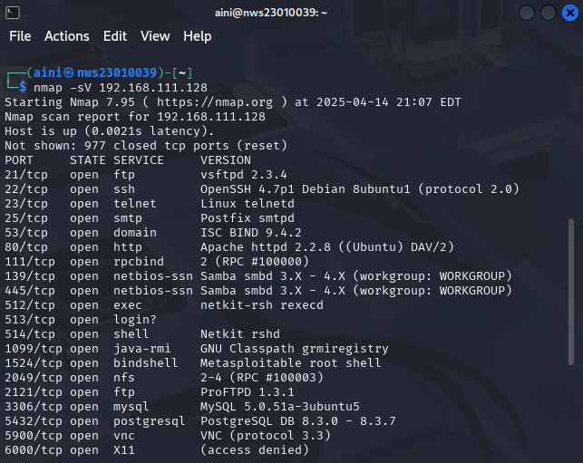
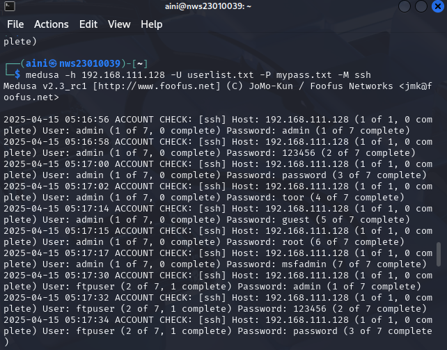

# LABWORK-1
# 🧪 Lab Tasks

## ✅ Task 1: Enumerate the Vulnerable VM to Discover Usernames


🎯 Objective:
Identify potential usernames that could be targeted in brute force attacks.


### 📜  Steps:
- Perform a service enumeration scan using tools like **Nmap** or **Nikto** to identify open ports and services running on the vulnerable VM.
- Use techniques such as directory brute-forcing or username enumeration to gather potential usernames.
- Document all discovered usernames and note their associated services (FTP, TELNET, SSH, HTTP).


### 🔧 Tools Used:
- **Nmap**: For service and port enumeration.


First, scan a target to discover open ports

📜 Command:
```bash
nmap -sV <TARGET_IP>
```
nmap -p- 192.168.111.128





## ✅ Task 2: Brute Force Attacks

### 2.1 🚪 FTP, TELNET, and SSH

### Objective:
Perform brute force attacks against the FTP, TELNET, and SSH services to gain unauthorized access.


### 🔧 Tools Used:

- **Hydra**
- **Medusa**
- **NetExec**


But,for this lab I used Hydra and Medusa

#### Before perform brute force attacks, make sure you have your own 
📝 Wordlists:

- A **list of usernames** (`userlist.txt`)
- A **list of passwords** (`mypass.txt`)

You a=can make this lists as your own lists using
 📜 Command:


 ```bash
  nano userlist.txt
```
and

 ```bash
  nano mypass.txt
```
 or

 
> You can use default ones from Kali:
```bash
/usr/share/wordlists/rockyou.txt
```


- For **🔓 FTP**:

📜 Command:

  ```bash
  hydra -L userlist.txt -P mypass.txt ftp://<TARGET_IP> -t 4 -vV
  ```

()


()


**Explanation:**

- `-L userlist.txt`: Specifies the file containing the usernames.

- `-P mypass.txt`: Specifies the file containing the passwords.

- `ftp://192.168.111.128:21`: Targets the FTP service at IP address 192.168.111.128 on port 21.

- `-t 4`: Specifies the number of parallel tasks (threads). You can adjust this number depending on your system's performance and the target server's response.

- `-vV`: Enables verbose output, showing detailed login attempts.


- For **🔌 TELNET**:

📜 Command:

  ```bash
  hydra -l userlist.txt -P mypass.txt telnet:// <TARGET_IP> -t 4 -vV -w 3
 
hydra -l userlist.txt -P mypass.txt telnet://192.168.111.128 -t 4 -vV -w 3


**Explanation:**

- `-L userlist.txt`: Specifies the file containing the usernames.

- `-P mypass.txt`: Specifies the file containing the passwords.

- `telnet://192.168.111.128:21`: Targets the TELNET service at IP address 192.168.111.128 

- `-t 4`: Specifies the number of parallel tasks (threads). You can adjust this number depending on your system's performance and the target server's response.

- `-vV`: Enables verbose output, showing detailed login attempts.

- `-w 3`: Sets a 3-second wait time between each login attempt.


For **🔐 SSH (Using Medusa)**:

📜 Command:


  ```bash
  medusa -h 192.168.111.128 -U userlist.txt -P mypass.txt -M ssh  
```




**Explanation:**

- `-h 192.168.111.128`: Specifies the target host IP address (192.168.111.128) that Medusa will attack. In this case, it's targeting the SSH service on that IP.

- `-U userlist.txt`: Specifies the file containing the list of usernames (userlist.txt). Each line in the file should have one username that Medusa will try to log in with.

- `-P mypass.txt`: Specifies the file containing the list of passwords (mypass.txt). Each line in this file should have one password that Medusa will try for each username.

- `-M ssh`: Tells Medusa to target the SSH service for brute-force attempts. This is a module that tells Medusa to use SSH as the protocol for login attempts.

- `-t 4`: Runs 4 parallel tasks (threads) for faster brute-forcing.

- `-vV`: Shows detailed login attempts in real-time.

- `-w 3`: Sets a 3-second wait time between each login attempt.


## 2.2 🌐 HTTP Login (Using Burp Suite)

### 🎯 Objective:

To automate brute force attacks against an HTTP login page.
Configure Intruder to test a list of usernames and passwords.
Analyze the results to identify successful logins.

### 🔧 Tools Used:

- **Burpsuite**


## 1. Open burpsuite on kali linux.Make  sure to turn the intercept on.


## 2. Open http://testphp.vulnweb.com/ on web inside the burp suite


## 3. Then,send the intercept inside the proxy to intruder


## 4. Switch to Cluster Bomb attack type and Set payload positions on both username and password fields.


## 5. Start attack.


**Explanation:**

- `200`:= OK

 Meaning: The request was successful.

Example: You accessed a valid page and the server responded properly.


- `302`:= Found (Redirect)

Meaning: The server is redirecting you to another page.

Example: Trying to access a page and getting redirected to a login page or homepage.


- `404`:= Not Found

Meaning: The page or resource does not exist.

Example: You tried to access a page like /admin123 that doesn’t exist.


## ✅ Task 3: Network Traffic Sniffing (Wireshark)

### 🔍 Objective:

To log in to the respective services.
Use Wireshark or tcpdump to capture and analyze network traffic during the session.

In this labwork,I used wireshark.


## 1. FTP


**Result:**

- ✅ Result: Credentials sent in plaintext.


## 2. TELNET


**Result:**

- 🔐 Result: Basic obfuscation/encryption.


## 3. SSH

  ```bash
  medusa -h 192.168.111.128 -U userlist.txt -P mypass.txt -M ssh  
```


**Result:**

- 🔐 Result: Fully encrypted session.


## 🧱 Problems Faced & Solutions


| Issue | Solution |
|-------|----------|
| Couldn't use certain command like hydra -L users.txt -P passwords.txt ftp://192.168.109.136 | Use new command like hydra -l userlist.txt -P my pass.txt ftp://<TARGET_IP> -t 4 -vV with some flags like -vV to enables verbose output 
| Hydra failed on SSH | Switched to Medusa |


##  🛡️ Mitigation Strategies

| Protocol | Vulnerability | Mitigation | Description |
|----------|----------------|------------|-------------|
| **FTP** | Sends data in plaintext | Use **SFTP** or **FTPS** | These encrypt login and file data. |
| **TELNET** | No encryption | Use **SSH** | SSH provides secure encrypted sessions. |
| **SSH** | Brute-force attacks | Use **key-based login**, **disable passwords**, **rate limit logins** | Harder to brute force, more secure access control. |
| **HTTP** | Sends data in plaintext | Use **HTTPS**, **CAPTCHA**, **account lockout** | Encrypts login data and prevents brute force. |


## 🕵️ Summary of Findings

During this lab, we performed enumeration and brute-force attacks on several services (FTP, TELNET, SSH, and HTTP) hosted on a vulnerable VM. Below are the key findings:

FTP and TELNET transmitted credentials in plaintext, making them highly susceptible to sniffing attacks.

SSH encrypted the session, but was still vulnerable to brute force attacks if weak credentials were used.

HTTP login pages without HTTPS exposed credentials, and were vulnerable to brute-forcing via tools like Burp Suite Intruder.

Successful brute-force attempts were logged for several services using tools like Hydra and Medusa.

Network traffic captured via Wireshark confirmed the (in)security of each protocol.