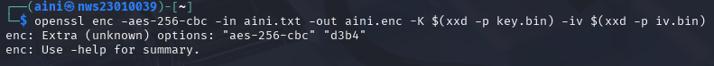
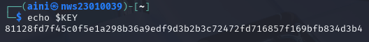
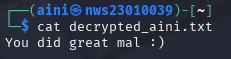
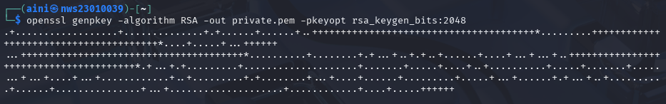
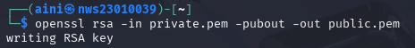
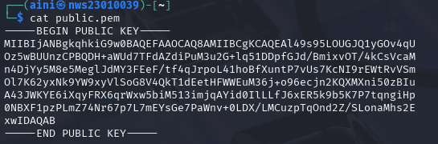
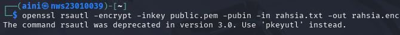
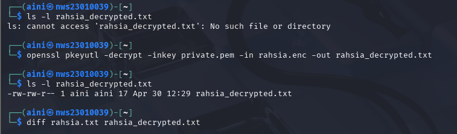

# LABWORK-3
 
# Hands-on Exploration of Cryptographic Tools: Hashing, Encryption, and Digital Signatures 🔐


---
### 🎯 Objectives

---

### 🛠️ Tools Used

- Kali Linux 

- openssl

## 📌 Task 1: Symmetric Encryption and Decryption using AES-256-CBC


 ### **1.1 Generate a 256-bit (32-byte) random key:** 

```bash
openssl rand -out key.bin 32
```
✅ This creates a secure random binary file (key.bin) of 32 bytes, suitable for AES-256.

### **1.2 Generate a 128-bit (16-byte) random IV:** 

```bash
openssl rand -out iv.bin 16
```
✅ The IV (Initialization Vector) is required for CBC mode encryption to ensure

### **1.3 Create a plaintext message file:**

```bash
echo "You did great mal :)" > aini.txt
```
✅ This writes your test message to aini.txt, which will be encrypted.


### **🔒 Encryption**

### **1.4 Convert binary key and IV to hex format without line breaks:**

```bash
openssl enc -aes-256-cbc -in aini.txt -out aini.enc -K $(xxd -p key.bin) -iv $(xxd -p iv.bin)
```



 "aes-256-cbc" "d3b4"
usually happens because $(xxd -p key.bin) or $(xxd -p iv.bin) is producing line breaks or spaces, which messes up the -K or -iv option.

✅ Fix: Convert binary to hex without newline
Try using xxd -p -c 256 to ensure it's all on one line:

KEY=$(xxd -p -c 256 key.bin)

IV=$(xxd -p -c 256 iv.bin)

openssl enc -aes-256-cbc -in aini.txt -out aini.enc -K $KEY -iv $IV  


🔍 Check values if needed:
echo $KEY  



echo $IV


This will ensure the key and IV are correctly passed to the openssl enc command.

openssl enc -d -aes-256-cbc -in aini.enc -out decrypted_aini.txt -K $KEY -iv $IV 

cat decrypted_aini.txt 


You did great mal :)


## Task 2

- openssl genpkey -algorithm RSA -out private.pem -pkeyopt rsa_keygen_bits:2048



openssl genpkey	: Uses OpenSSL’s utility to generate a private key.
-algorithm RSA :	Specifies that the key type to generate is RSA (widely used for encryption, digital signatures, etc.).
-out private.pem	: Tells OpenSSL to save the private key in a file named private.pem.
-pkeyopt rsa_keygen_bits:2048 :	Sets the key size to 2048 bits (which is secure enough for most purposes).


📂 Result:
A file named private.pem will be created.

It contains your RSA private key in PEM format.

You can inspect the key with:

bash
Copy code
openssl pkey -in private.pem -text -noout


- openssl rsa -in private.pem -pubout -out public.pem 



openssl rsa	: Tells OpenSSL to use the RSA key processing tool.
-in private.pem	: Reads the private key from private.pem. This key was generated earlier using genpkey.
-pubout :	Instructs OpenSSL to extract the public key from the given private key.
-out public.pem	: Saves the public key to a file named public.pem.

📂 Result:
You now have:

private.pem: Your RSA private key

public.pem: Your corresponding RSA public key

🧪 Optional: View the public key
bash
Copy code
cat public.pem
or for a structured view:



bash
Copy code
openssl pkey -pubin -in public.pem -text -noout


- echo "ini rahsia tuhan" > rahsia.txt 


- openssl rsautl -encrypt -inkey public.pem -pubin -in rahsia.txt -out rahsia.enc




 as of OpenSSL 3.0, rsautl is deprecated. The recommended alternative is to use openssl pkeyutl for RSA encryption/decryption.

Encrypt using public key:
 - openssl pkeyutl -encrypt -pubin -inkey public.pem -in rahsia.txt -out rahsia.enc

Decrypt using private key:
- openssl pkeyutl -decrypt -inkey private.pem -in rahsia.enc -out decrypted_rahsia.txt


Compare original and decrypted file:
 - diff rahsia.txt rahsia_decrypted.txt

 

Step-by-Step Instructions
🔐 1. Generate a Strong Random Key & IV
On Labu (Sender):

# Generate a 256-bit (32 bytes) key
openssl rand -hex 32 > key.bin

# Generate a 128-bit (16 bytes) IV (Initialization Vector)
openssl rand -hex 16 > iv.bin


2. Create a Message File
Still on Labu, create your message file:
echo "This is a secret message for Labi from Labu." > labu.txt


3. Encrypt the Message with AES-256-CBC
bash
Copy code
openssl enc -aes-256-cbc -in labu.txt -out labu.enc -K $(cat key.bin) -iv $(cat iv.bin)
Note:
-K requires a hex-encoded 256-bit key (64 hex chars).
-iv requires a hex-encoded 128-bit IV (32 hex chars).


5. Decrypt the Message on Labi
On Labi:
bash
Copy code
openssl enc -d -aes-256-cbc -in akmal.enc -out decrypted.txt -K $(cat key.bin) -iv $(cat iv.bin)

Check the decrypted message:
Open the decrypted.txt file to verify the message:
cat decrypted.txt

It should contain the original message sent by Labu.


Task 2: Asymmetric Encryption & Decryption using RSA (OpenSSL)
✅ Step 1: Generate RSA Key Pair (on Labi side)
On Labi’s machine (the one receiving the message):

# Generate a 2048-bit RSA private key
openssl genpkey -algorithm RSA -out private_key.pem -pkeyopt rsa_keygen_bits:2048


# Extract the public key from the private key
openssl rsa -pubout -in private_key.pem -out public_key.pem

Now you have:
private_key.pem (only for Labi – keep secret)
public_key.pem (to share with Labu)

Step 2: Transfer public_key.pem to Labu

Step 3: Encrypt Message on Labu (sender)
On Labu’s machine:
1.Create your secret message:
echo "Ini rahsia penting untuk Labi sahaja." > rahsia.txt


2.Encrypt the message using Labi's public key:
openssl pkeyutl -encrypt -pubin -inkey public_key.pem -in ../rahsia.txt -out ../rahsia.enc

Step 4: Decrypt Message on Labi (receiver)
On Labi’s machine:
1.Receive the file rahsia.enc from Labu.
2.Decrypt it using your private key:
openssl pkeyutl -decrypt -inkey private_key.pem -in rahsia.enc -out rahsia_decrypted.txt
✅ Step 5: Verify the Decryption
Check if the decrypted file is correct:
cat decrypted.txt


Compare the decrypted content with the original message from rahsia.txt.
diff rahsia.txt decrypted.txt

If there's no output, the files are identical ✅


Lab 3
Step 1: Create a Text File
echo "aku pilih madu…. sila sambung" > akmal.txt

✅ Step 2: Generate SHA-256 Hash Using OpenSSL
openssl dgst -sha256 akmal.txt
Output:
SHA2-256(akmal.txt)= 3650645a30afffd40020afcc6c699081ea11bf2a08199f7ee745b3178d0c457d
can also try:
sha256sum akmal.txt
Output:
3650645a30afffd40020afcc6c699081ea11bf2a08199f7ee745b3178d0c457d  akmal.txt

✅ Both tools give the same hash but differ in formatting. openssl prefixes with SHA256(filename)=, while sha256sum shows the hash followed by the filename.

✅ Step 3: Modify the File
Change just one character:
nano akmal.txt

Step 4: Generate Hash of the Modified File


TASK 4
Task 4: Digital Signatures using RSA (from scratch)
🎯 Scenario:
Labu wants to sign a document (agreement.txt) to prove to Labi that the message is authentic and hasn’t been tampered with.

🧪 Step-by-Step Lab Instructions
✅ Step 1: Generate RSA Keys for Labu
Generate a 2048-bit RSA private key (Labu keeps this secret):

openssl genpkey -algorithm RSA -out labu_private.pem -pkeyopt rsa_keygen_bits:2048

Extract the corresponding public key (to share with Labi)
openssl rsa -pubout -in akmal_private.pem -out akmal_public.pem  


✅ Step 2: Create the document to sign
Labu creates the document:
echo "This is the agreement between Labu and Labi." > agreement.txt


✅ Step 3: Sign the document using Labu’s private key
Generate a SHA-256 digital signature:
cd /home/akmal/Downloads
openssl dgst -sha256 -sign akmal_private.pem -out signature.bin ../agreement.txt

This creates signature.bin, the signed hash of the document.


✅ Step 4: Verify the signature using Labu’s public key
Labi receives agreement.txt, signature.bin, and labu_public.pem, then verifies:

openssl dgst -sha256 -verify labu_public.pem -signature signature.bin agreement.txt
If the file is unaltered, you’ll see:
Verified OK

✅ Step 5: Simulate tampering and verify again
Modify the document:

echo "This clause is added without consent." >> agreement.txt
Now verify again:

openssl dgst -sha256 -verify labu_public.pem -signature signature.bin agreement.txt
You’ll see:
Verification Failure

🧠 Explanation: Why does verification fail?
The signature is based on a hash of the original file content. When even one character is changed:
The hash changes
The signature no longer matches the new hash
So OpenSSL fails the verification to protect against tampering or forgery.