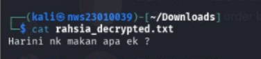
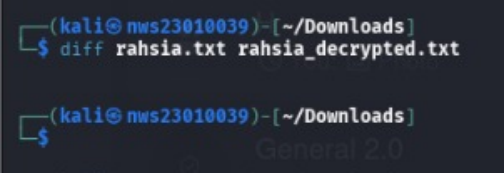
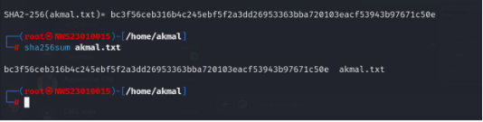
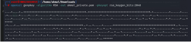
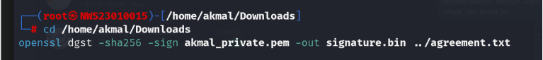

# LABWORK-3
 
# Hands-on Exploration of Cryptographic Tools: Hashing, Encryption, and Digital Signatures 🔐


---
### 🎯 Objectives
- Encrypt and decrypt files using symmetric and asymmetric encryption

- Generate and verify hashes

- Create and verify digital signatures.
---

### 🛠️ Tools Used

- Kali Linux 

- openssl

## 📌 Task 1: Symmetric Encryption and Decryption using AES-256-CBC


 ### **1.1 Generate a 256-bit (32-byte) random key:** 

```bash
openssl rand -out key.bin 32
```
✅ This creates a secure random binary file (key.bin) of 32 bytes, suitable for AES-256.

### **1.2 Generate a 128-bit (16-byte) random IV:** 

```bash
openssl rand -out iv.bin 16
```
✅ The IV (Initialization Vector) is required for CBC mode encryption to ensure

### **1.3 Create a plaintext message file:**

```bash
echo "You did great mal :)" > aini.txt
```
✅ This writes your test message to aini.txt, which will be encrypted.


### **🔒 Encryption**

### **1.4 Convert binary key and IV to hex format without line breaks:**

```bash
openssl enc -aes-256-cbc -in aini.txt -out aini.enc -K $(xxd -p key.bin) -iv $(xxd -p iv.bin)
```


 "aes-256-cbc" "d3b4"
usually happens because $(xxd -p key.bin) or $(xxd -p iv.bin) is producing line breaks or spaces, which messes up the -K or -iv option.

### **✅ Fix: Convert binary to hex without newline** ###

Try using xxd -p -c 256 to ensure it's all on one line:


```bash
KEY=$(xxd -p -c 256 key.bin)
```

```bash
IV=$(xxd -p -c 256 iv.bin)
```

✅ The -c 256 option ensures that the entire hex string is on one line. This prevents formatting errors when passing to OpenSSL.


### **🔍 Check values if needed:** ###

```bash
echo $KEY  
```


```bash
echo $IV  
```


This will ensure the key and IV are correctly passed to the openssl enc command.


### **1.5 Encrypt the message using AES-256-CBC:**

```bash
openssl enc -aes-256-cbc -in aini.txt -out aini.enc -K $KEY -iv $IV
```
✅ This encrypts the content of aini.txt using the specified key and IV and saves the output to aini.enc.


### **🔒 Decryption**

```bash
openssl enc -d -aes-256-cbc -in aini.enc -out decrypted_aini.txt -K $KEY -iv $IV 
```

### ** 1.6 Display the decrypted content:** ###

```bash
cat decrypted_aini.txt 
```


You did great mal :)


##  📌 Task 2: Asymmetric Encryption and Decryption using RSA

### **Generate a private RSA key (2048 bits):** ###

```bash
openssl genpkey -algorithm RSA -out private.pem -pkeyopt rsa_keygen_bits:2048
```


✅ This creates a private key (private_key.pem) using the RSA algorithm with a 2048-bit key size.

**Extract the corresponding public key**

```bash
openssl rsa -pubout -in private_key.pem -out public_key.pem
```


✅ This generates a public key (public_key.pem) from the private key.

- private_key.pem (only for Aini – keep secret)
- public_key.pem (to share with Akmal)

**Create a message file to encrypt**

```bash
echo "This is an RSA test message." > rsa_message.txt
```


**Encrypt the message using the Aini's public key**

```bash
openssl pkeyutl -encrypt -pubin -inkey public_key.pem -in ../rahsia.txt -out ../rahsia.enc
```


✅ This encrypts the plaintext using the public key. Only the private key can decrypt this.

 **Decrypt the message using the private key**

 On Aini’s machine:

1.Receive the file rahsia.txt from Akmal.

2.Decrypt it using your private key:

```bash
openssl pkeyutl -decrypt  -inkey private_key.pem -in rahsia.enc -out rahsia_decrypted.txt
```


**View the decrypted message**

```bash
cat decrypted.txt
```


**📄 Output:**

Harini nk makan apa ek ?

**Compare the decrypted content with the original message from rahsia.txt**

```bash
diff rahsia.txt decrypted.txt
```

If there's no output, the files are identical ✅


##  📌 Task 3: Hashing and Message Integrity using SHA-256

**3.1 Create a file to hash**

```bash
echo "aku pilih madu…. sila sambung" > akmal.txt
```

**3.2 Generate SHA-256 hash**

```bash
openssl dgst -sha256 akmal.txt
```


**📄 Output:**
SHA2-256(akmal.txt)= 3650645a30afffd40020afcc6c699081ea11bf2a08199f7ee745b3178d0c457d

**You can also try:**

```bash
sha256sum akmal.txt
```


✅ Both tools give the same hash but differ in formatting. openssl prefixes with SHA256(filename)=, while sha256sum shows the hash followed by the filename.

**3.3 Modify the File**

```bash
nano akmal.txt
```


**3.4  Generate Hash of the Modified File**



This just to show that even one character changed,the whole hash also will change


##  📌 Task 4 : Digital Signatures using RSA

**4.1 Generate RSA Keys for Akmal**


```bash
openssl genpkey -algorithm RSA -out labu_private.pem -pkeyopt rsa_keygen_bits:2048
```


Generate a 2048-bit RSA private key (Akmal keeps this secret)


**4.2 Extract the corresponding public key (to share with Aini)**

```bash
openssl rsa -pubout -in akmal_private.pem -out akmal_public.pem
```


**4.2 Create the document to sign**

Akmal creates the document:

```bash
echo "This is very important Senahhhhh." > agreement.txt
```


**4.2  Sign the document using Akmal’s private key**

Generate a SHA-256 digital signature

```bash
cd /home/akmal/Downloads
```

```bash
openssl dgst -sha256 -sign akmal_private.pem -out signature.bin ../agreement.txt
```




**4.3 Verify the signature using Labu’s public key**

Labi receives agreement.txt, signature.bin, and labu_public.pem, then verifies

```bash
openssl dgst -sha256 -verify labu_public.pem -signature signature.bin agreement.txt
```

If the file is unaltered, you’ll see:

**Verified OK**

**4.4 Simulate tampering and verify again**

Modify the document:

```bash
echo "This clause is added without consent." >> agreement.txt
```

Now verify again:

```bash
openssl dgst -sha256 -verify labu_public.pem -signature signature.bin agreement.txt
```

You’ll see:

**Verification Failure**

**🧠 Explanation:Why does verification fail?**

The signature is based on a hash of the original file content. When even one character is changed:
- The hash changes
- The signature no longer matches the new hash

So OpenSSL fails the verification to protect against tampering or forgery.


