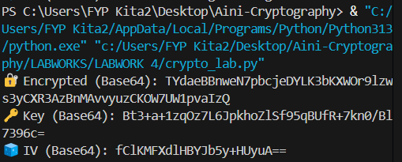

# LABWORK-2 
 
# Lab 4: Implementing Cryptography with Python	🔐


## 📚 Overview

This lab demonstrates fundamental cryptographic techniques using Python and the `pycryptodome` library. The lab includes:

1. **Symmetric Encryption (AES)**
2. **Asymmetric Encryption (RSA)**
3. **Hashing (SHA-256)**
4. **Digital Signatures (RSA)**

> 💻 Developed using Python in VS Code  
> 🧑‍🤝‍🧑 Collaborated between two students using encrypted file exchange via WhatsApp

---

## 📦 Requirements

- Python 3.x
- [pycryptodome](https://pypi.org/project/pycryptodome/)

Install with:

```bash
pip install pycryptodome
```
---
## 🔐 Task 1: Symmetric Encryption (AES)

### 🎯 Objectives
Encrypt and decrypt a message using AES (CBC mode with AES-256 key).
 
 ---

### ENCRYPT (AINI)
 
```bash
from Crypto.Cipher import AES
from Crypto.Random import get_random_bytes
import base64

#Helper: Padding function (PKCS7-style)
def pad(data):
    pad_len = 16 - len(data) % 16
    return data + bytes([pad_len] * pad_len)

#Your message
message = b"NUR QURRATU'AINI BALQIS ,NWS23010039"

#Generate a 256-bit (32-byte) key and a 16-byte IV
key = get_random_bytes(32)  # AES-256
iv = get_random_bytes(16)   # IV must be 16 bytes

#Create cipher object with AES-256 in CBC mode
cipher = AES.new(key, AES.MODE_CBC, iv)

#Encrypt the padded message
ciphertext = cipher.encrypt(pad(message))

#Encode values to base64 for safe transfer
b64_cipher = base64.b64encode(ciphertext).decode()
b64_key = base64.b64encode(key).decode()
b64_iv = base64.b64encode(iv).decode()

#Print to send to your friend
print("🔐 Encrypted (Base64):", b64_cipher)
print("🔑 Key (Base64):", b64_key)
print("🧊 IV (Base64):", b64_iv)
 ```


 ### DECRYPT (AKMAL)

 
```bash
from Crypto.Cipher import AES
import base64

#Helper: Unpadding function
def unpad(data):
    return data[:-data[-1]]

#Paste received values here
b64_cipher=" TYdaeBBnweN7pbcjeDYLK3bKXWOr9lzws3yCXR3AzBnMAvvyuzCKOW7UW1pvaIzQ"
b64_key ="Bt3+a+1zqOz7L6JpkhoZlSf95qBUfR+7kn0/Bl7396c=="
b64_iv = "fClKMFXdlHBYJb5y+HUyuA=="

#Decode from base64
ciphertext = base64.b64decode(b64_cipher)
key = base64.b64decode(b64_key)
iv = base64.b64decode(b64_iv)

#Decrypt
cipher = AES.new(key, AES.MODE_CBC, iv)
decrypted = unpad(cipher.decrypt(ciphertext))

#Show result
print("🔓 Decrypted message:", decrypted.decode())
```


## 🔐 Task 2: Asymmetric Encryption (RSA)

### 🎯 Objectives
Encrypt and decrypt messages using RSA keys.


### 1. Key Generation Script

### Generate RSA key pair (public and private key)


```bash
# rsa_keygen.py
from Crypto.PublicKey import RSA

# Generate a 2048-bit RSA key pair
key = RSA.generate(2048)

# Save private key
with open("private.pem", "wb") as priv_file:
    priv_file.write(key.export_key())

# Save public key
with open("public.pem", "wb") as pub_file:
    pub_file.write(key.publickey().export_key())

print("✅ RSA key pair generated and saved.")
```
- Then,Aini will send public key file (public,pem) to akmal.

### 2. Encryption Script (Using Public Key)


- Akmal will receive the file and download.Now Akmal has the file and try to encrypt message using Aini's public key

```bash
# rsa_encrypt.py
from Crypto.PublicKey import RSA
from Crypto.Cipher import PKCS1_OAEP
import base64

# Your plaintext message
message = b"Hi Aini! This is Akmal - Encrypyed using your public key!"

# Load public key
with open("public.pem", "rb") as f:
    public_key = RSA.import_key(f.read())

# Create cipher
cipher_rsa = PKCS1_OAEP.new(public_key)
ciphertext = cipher_rsa.encrypt(message)

# Encode to base64 for easy sharing
b64_cipher = base64.b64encode(ciphertext).decode()

# Save encrypted message to a file
with open("encrypted_rsa.txt","w") as f :
f.write(b64_cipher)

print("✅ Encrypted message (Base64):", b64_cipher)

```

### 3. Decryption Script (Using Private Key)

- Aini will donwload the file of encrypted message (encrypted_rsa.txt) and try to decrypt the message using Aini's private key

```bash
from Crypto.PublicKey import RSA
from Crypto.Cipher import PKCS1_OAEP
import base64

# Load private key
private_key = RSA.import_key(open("private.pem").read())

# Read encrypted message
with open("encrypted_rsa.txt", "r") as f:
    b64_cipher = f.read()

# Decode from Base64
ciphertext = base64.b64decode(b64_cipher)

# Decrypt
cipher_rsa = PKCS1_OAEP.new(private_key)
message = cipher_rsa.decrypt(ciphertext)

print("🔓 Decrypted message:", message.decode())
```


## 🔐 Task 3: Hashing (SHA-256)

### 🎯 Objectives
- Compute the SHA-256 hash of a string message.

- Compute the SHA-256 hash of a file.

- Capture screenshot outputs for different inputs.

```bash
import hashlib

#File to hash (same directory)
filename = "example.txt"

#Read file in binary mode
with open(filename, "rb") as f:
    file_data = f.read()

#Generate hash
hash_object = hashlib.sha256(file_data)
hex_dig = hash_object.hexdigest()

print("📄 File:", filename)
print("🔐 SHA-256 Hash:", hex_dig)
 ```

 
## 🔐 Task 4: Digital Signatures (RSA)

 Objective:

- Sign a message using an RSA private key.

- Verify the signature using the corresponding public key.

- Screenshot the output of signing and verifying.

```bash
from Crypto.Signature import pkcs1_15
from Crypto.Hash import SHA256
from Crypto.PublicKey import RSA
import base64

# Load private key (i've already generated it)
private_key = RSA.import_key(open("private.pem").read())

# Message to sign
message = b"Digital signature test from Aini, CB123456"

# Hash the message first
hash_obj = SHA256.new(message)

# Sign the hash with your private key
signature = pkcs1_15.new(private_key).sign(hash_obj)

# Encode signature in base64 for transmission (optional)
b64_signature = base64.b64encode(signature).decode()

# Save signed message and signature
with open("signed_message.txt", "wb") as f:
    f.write(message)

with open("signature.txt", "w") as f:
    f.write(b64_signature)

# Output signature for debugging or to send
print("✅ Message signed!")
print("✉️ Signature (Base64):", b64_signature)

```

- Aini will sign  a message using RSA private key togetehr with signature.Then,Aini will send three files which are signed_message.txt , signature.txt and public,pem to Akmal.


### Verify the Signature (Using Public Key)

```bash
from Crypto.Signature import pkcs1_15
from Crypto.Hash import SHA256
from Crypto.PublicKey import RSA
import base64

# Load the public key
public_key = RSA.import_key(open("public.pem").read())

# Read the signed message and the signature
with open("signed_message.txt", "rb") as f:
    message = f.read()

with open("signature.txt", "r") as f:
    b64_signature = f.read()

# Decode the signature from Base64
signature = base64.b64decode(b64_signature)

# Hash the message again
hash_obj = SHA256.new(message)

# Verify the signature using the public key
try:
    pkcs1_15.new(public_key).verify(hash_obj, signature)
    print("✅ Signature is valid.")
except (ValueError, TypeError):
    print("❌ Signature is invalid.")

```

- Then,Akmal will download all three files and Read your original message from signed_message.txt.

- Hash the message using SHA-256.

- Decrypt the signature using your public key (from public.pem).

- Compare the decrypted hash with the one they just computed.

- If they match: ✅ The message is authentic and hasn’t been tampered with.

- If they don't match: ❌ The message has been altered or the signature is invalid.

