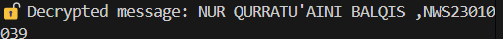

### TASK 1 (AES 256 CBC)

## ENCRYPT (AINI)

from Crypto.Cipher import AES
from Crypto.Random import get_random_bytes
import base64

#Helper: Padding function (PKCS7-style)
def pad(data):
    pad_len = 16 - len(data) % 16
    return data + bytes([pad_len] * pad_len)

#Your message
message = b"NUR QURRATU'AINI BALQIS ,NWS23010039"

#Generate a 256-bit (32-byte) key and a 16-byte IV
key = get_random_bytes(32)  # AES-256
iv = get_random_bytes(16)   # IV must be 16 bytes

#Create cipher object with AES-256 in CBC mode
cipher = AES.new(key, AES.MODE_CBC, iv)

#Encrypt the padded message
ciphertext = cipher.encrypt(pad(message))

#Encode values to base64 for safe transfer
b64_cipher = base64.b64encode(ciphertext).decode()
b64_key = base64.b64encode(key).decode()
b64_iv = base64.b64encode(iv).decode()

#Print to send to your friend
print("🔐 Encrypted (Base64):", b64_cipher)
print("🔑 Key (Base64):", b64_key)
print("🧊 IV (Base64):", b64_iv)

 ## DECRYPT (AKMAL)

from Crypto.Cipher import AES
import base64

#Helper: Unpadding function
def unpad(data):
    return data[:-data[-1]]

#Paste received values here
b64_cipher=" TYdaeBBnweN7pbcjeDYLK3bKXWOr9lzws3yCXR3AzBnMAvvyuzCKOW7UW1pvaIzQ"
b64_key ="Bt3+a+1zqOz7L6JpkhoZlSf95qBUfR+7kn0/Bl7396c=="
b64_iv = "fClKMFXdlHBYJb5y+HUyuA=="

#Decode from base64
ciphertext = base64.b64decode(b64_cipher)
key = base64.b64decode(b64_key)
iv = base64.b64decode(b64_iv)

#Decrypt
cipher = AES.new(key, AES.MODE_CBC, iv)
decrypted = unpad(cipher.decrypt(ciphertext))

#Show result
print("🔓 Decrypted message:", decrypted.decode())

### TASK 2 (RSA)

## ENDER (AINI)(GENERATE PUBLIC AND PRIVATE KEY)

from Crypto.PublicKey import RSA
from Crypto.Cipher import PKCS1_OAEP
import base64

#Generate RSA key pair (2048 bits)
key = RSA.generate(2048)

private_key = key.export_key()
public_key = key.publickey().export_key()

#Save keys to files
with open("private.pem", "wb") as f:
    f.write(private_key)

with open("public.pem", "wb") as f:
    f.write(public_key)

#Message to encrypt
message = b"Hello from Aini, CB123456 - Cryptography Lab!"

#Encrypt message with public key
recipient_key = RSA.import_key(open("public.pem").read())
cipher_rsa = PKCS1_OAEP.new(recipient_key)
ciphertext = cipher_rsa.encrypt(message)

#Base64 encode ciphertext to send
b64_cipher = base64.b64encode(ciphertext).decode()

#Save to file or share via WhatsApp
with open("encrypted_rsa.txt", "w") as f:
    f.write(b64_cipher)

print("✅ Encrypted message (Base64):", b64_cipher)

## RECEIVER (AKMAL)

from Crypto.PublicKey import RSA
from Crypto.Cipher import PKCS1_OAEP
import base64

#Load private key
private_key = RSA.import_key(open("private.pem").read())

#Read encrypted message
with open("encrypted_rsa.txt", "r") as f:
    b64_cipher = f.read()

#Decode from Base64
ciphertext = base64.b64decode(b64_cipher)

#Decrypt
cipher_rsa = PKCS1_OAEP.new(private_key)
message = cipher_rsa.decrypt(ciphertext)

print("🔓 Decrypted message:", message.decode())

### TASK 3

## HASH

import hashlib

#File to hash (same directory)
filename = "example.txt"

#Read file in binary mode
with open(filename, "rb") as f:
    file_data = f.read()

#Generate hash
hash_object = hashlib.sha256(file_data)
hex_dig = hash_object.hexdigest()

print("📄 File:", filename)
print("🔐 SHA-256 Hash:", hex_dig)

## TASK 4 (DIGITAL SIGNATURE)

