## Task 1: Generate Your GPG Key Pair

### Step 1: Install GPG (if not already installed)
First, ensure that GPG is installed on your Kali VM. You can check this by running:
```bash
gpg --version
```
If GPG is not installed, run the following to install it:

```bash
sudo apt update
sudo apt install gnupg
```

## Step 2: Generate Your GPG Key Pair
To generate the key pair, use the following command:

```bash
gpg --full-generate-key
```


Key Type: Choose RSA and RSA (option 1) for both signing and encryption.

Key Size:  4096 

Key Expiry: 1y

Name: Nur Qurratu'Aini Balqis 

Email: nurqurratuaini.zolkefli@student.gmi.edu.my

Passphrase: GPG_key2025

### Step 3: List Your Keys

Once the key is generated, you can view it using the following command:
```bash
gpg --list-keys
```


### Step 4: Export Your Public Key (Optional)
To use the public key with SSH or share it with others, you can export it like this:

```bash  
pg --armor --export nurqurratuaini.zolkefli@student.gmi.edu.my mypublickey.asc
```


### Step 5: Use GPG Key for SSH Authentication
To use your GPG key for SSH authentication, you'll need to configure SSH to use the key.

### 1) Enable GPG key for SSH:
```bash
 gpg --export-ssh-key nurqurratuaini.zolkefli@student.gmi.edu.my ~/.ssh/id_gpg.pub
```


### 2) Copy the key to the remote server (in this case, your Kali VM):


```bash
cat ~/.ssh/id_rsa.pub | ssh aini@10.100.121.76 'cat >> ~/.ssh/authorized_keys'
```


## Now that my public key is on the Kali VM, test logging in using SSH from my Windows machine:

```bash
ssh aini@10.100.121.76
```


## Task 2: Encrypt and Decrypt a File

### Step 1: Create the message.txt file

Use a text editor like nano to create the message.txt file:

```bash
nano message.txt
```

Edit in  the file : This file was encrypted by Nur Qurratu'Aini Balqis (nws23010039)


Save the file

### Step 2 : Encrypt the File

Now, encrypt the message.txt file using your GPG public key. Use the following command to encrypt the file:

```bash
gpg --output message.txt.gpg --encrypt --recipient nurqurratuaini.zolkefli@student.gmi.edu.my message.txt
```

### Step 3 : Decrypt the File

Now, decrypt the encrypted file (message.txt.gpg) to verify that the process works.

Use the following command to decrypt the file:
```bash
gpg --output message_decrypted.txt --decrypt message.txt.gpg
```


### Step 4 : Verify the Decrypted File

Finally, verify that the content is correctly decrypted by viewing the contents of message_decrypted.txt:

```bash
cat message_decrypted.txt
```


The original message:
This file was encrypted by Nur Qurratu'Aini Balqis (nws23010039)


## Task 3: Sign and Verify a Message

### Step 1: Create a Signed Message File

First, create the message file signed_message.txt with the content:

```bash
echo "I, Nur Qurratu'Aini Balqis, declare this is my work." > signed_message.txt
```

### Step 2 : Sign the File Using GPG

--clearsign: This method signs the message and allows it to remain readable by humans (it’s a signed version of the message).

For this task, we’ll use --clearsign, which signs the message directly.

```bash
gpg --clearsign signed_message.txt
```

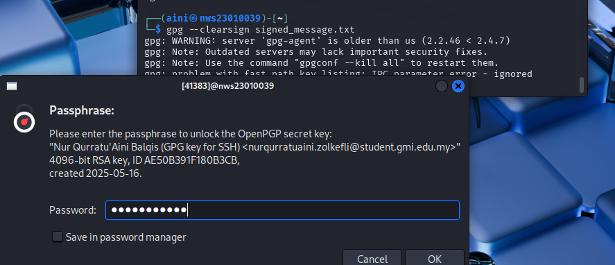

### Step 3 : Verify Your Signature

```bash
gpg --verify signed_message.txt.asc
```

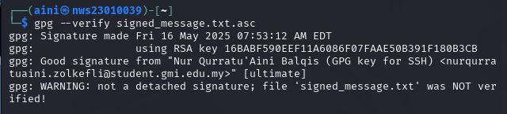

 "Good signature from..." in the output, confirming that the signature is valid and the message is authentic.


## Task 4: Configure Passwordless SSH Authentication

### Step 1: Generate an SSH Key Pair with Your Name and ID as a Comment

First,I'll generate an SSH key pair with my name and student ID as the comment.


```bash
ssh-keygen -C "Nur Qurratu'Aini Balqis-nws23010039"
```
Enter a passphrase or leave it empty (for passwordless login, it's common to leave it empty).

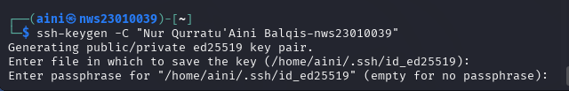
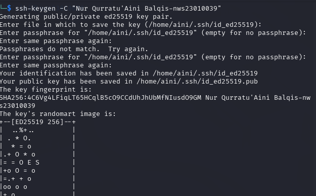


This will generate two files:

- id_rsa: The private key (keep this secure and don’t share it).

- id_rsa.pub: The public key (this is the one you will add to the remote server's authorized_keys file).


### Step 2: Configure Passwordless Login

Run the following command to view the public key

```bash
cat ~/.ssh/id_rsa.pub
```

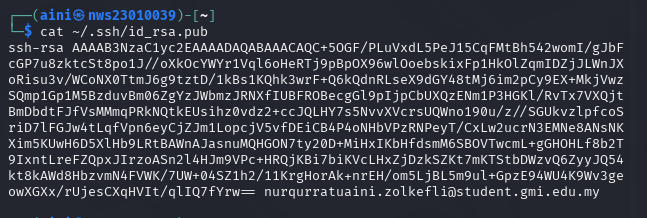

Copy the output (public key).


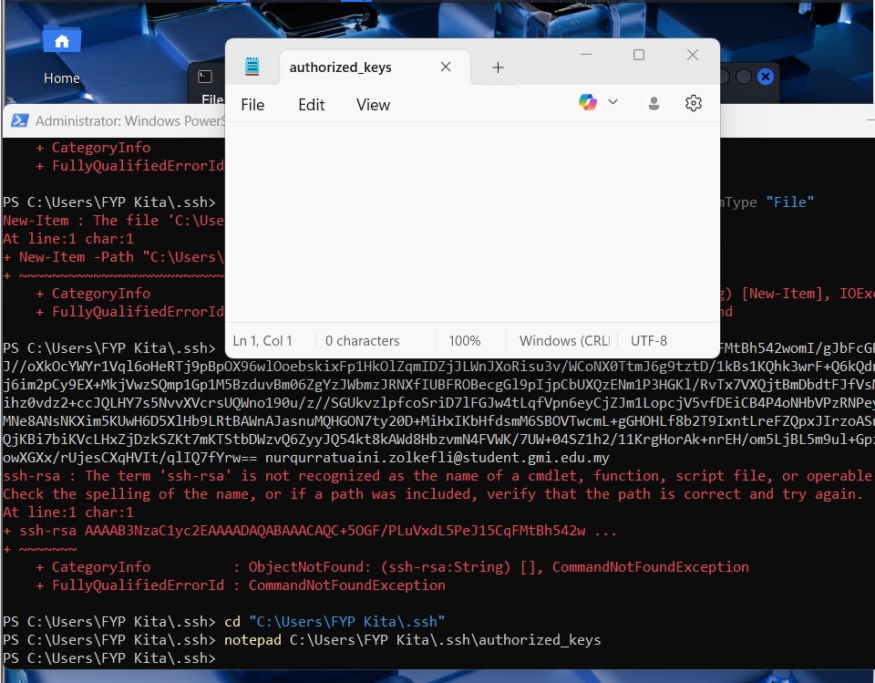
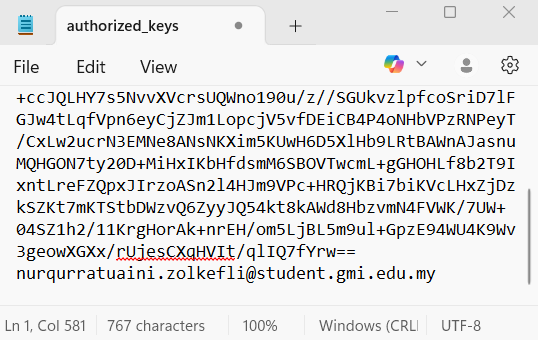

To ensure the authorized_keys file has the right permissions, run this in Windows PowerShell:

```bash
icacls "C:\Users\FYP Kita\.ssh\authorized_keys" /inheritance:r /grant:r "FYP Kita:F"
```


---

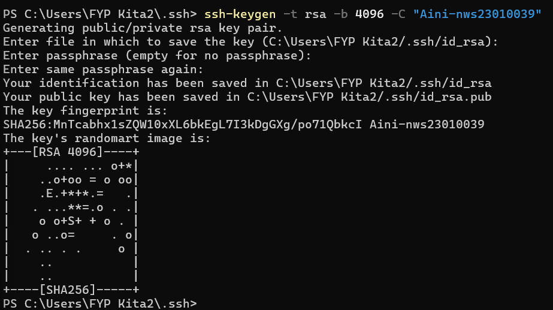
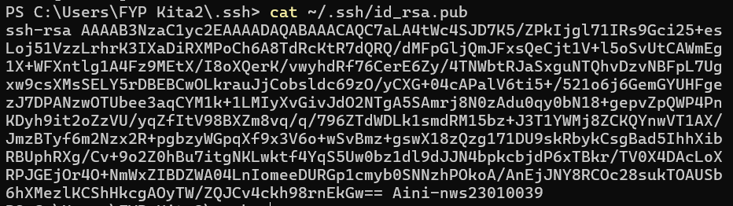
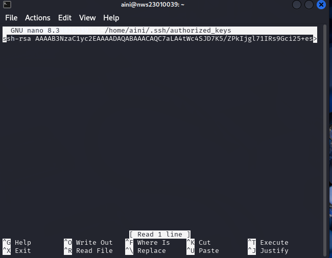


## Task 5: Hash Cracking Challenge

### 1) SnZlcmV4IEF2IEpmcmNyZSBFeiBCcnJl

Create a wordlist file first:
```bash 
nano custom_wordlist.txt   
```


Then,crack


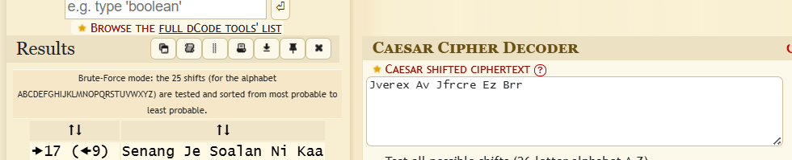

### 2) 7b77ca1e2b3e7228a82ecbc7ca0e6b52
 
```bash
john --format=raw-md5 --wordlist=custom_wordlist.txt md5_hash.txt  
```

To confirm the cracked password, run the following command:

```bash
john --show --format=raw-md5 md5_hash.txt
```

To view all cracked passwords in the john.pot file by running:
```bash
cat ~/.john/john.pot
```

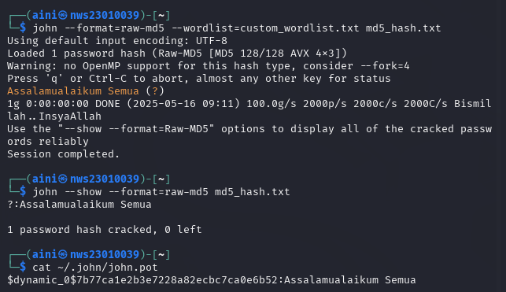

### 3) e583cee9ab9d7626c970fd6e9938fcb2d06fbbd12f1c1a3c6902a215808c825c

First create the file :

```bash
echo "e583cee9ab9d7626c970fd6e9938fcb2d06fbbd12f1c1a3c6902a215808c825c" > sha256_hash.txt
```

Then,crack:

```bash
john --format=raw-sha256 --wordlist=custom_wordlist.txt sha256_hash.txt
```

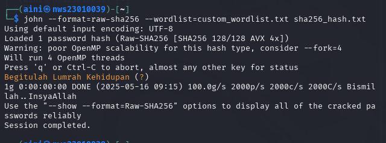

Then,check:

```bash
cat ~/.john/john.pot 
```

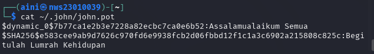
