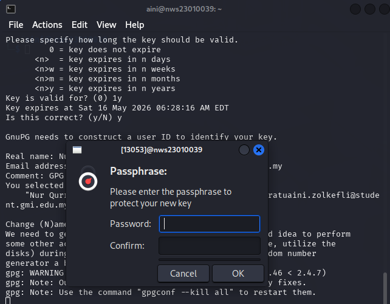
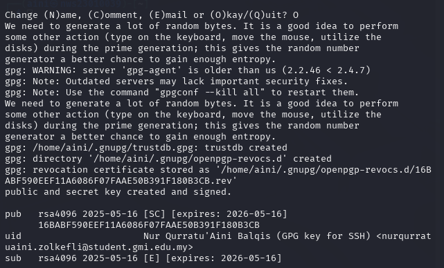
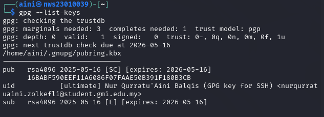
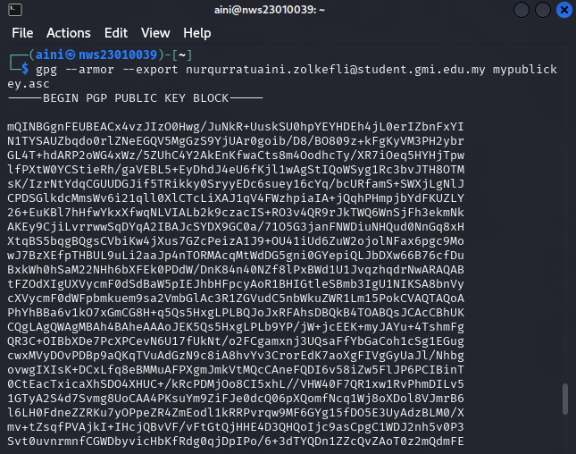
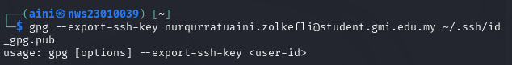
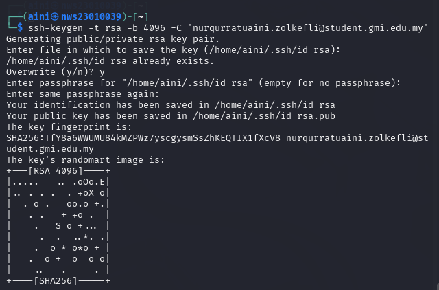
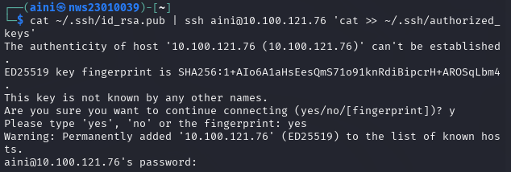
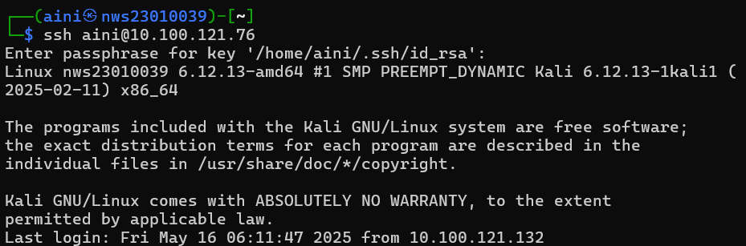
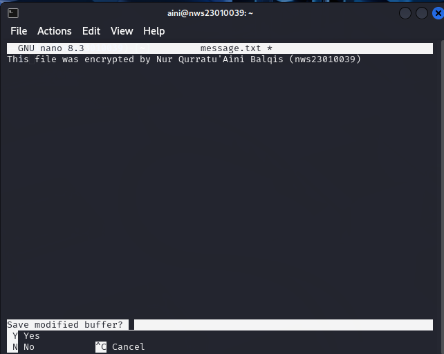
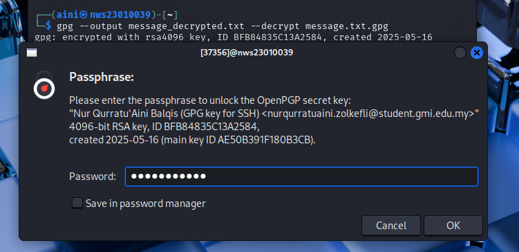

## Task 1: Generate Your GPG Key Pair

### Step 1: Install GPG (if not already installed)
First, ensure that GPG is installed on your Kali VM. You can check this by running:
```bash
gpg --version
```
If GPG is not installed, run the following to install it:

```bash
sudo apt update
sudo apt install gnupg
```

## Step 2: Generate Your GPG Key Pair
To generate the key pair, use the following command:

```bash
gpg --full-generate-key
```



Key Type: Choose RSA and RSA (option 1) for both signing and encryption.

Key Size:  4096 

Key Expiry: 1y

Name: Nur Qurratu'Aini Balqis 

Email: nurqurratuaini.zolkefli@student.gmi.edu.my

Passphrase: GPG_key2025

### Step 3: List Your Keys

Once the key is generated, you can view it using the following command:
```bash
gpg --list-keys
```



### Step 4: Export Your Public Key (Optional)
To use the public key with SSH or share it with others, you can export it like this:

```bash  
pg --armor --export nurqurratuaini.zolkefli@student.gmi.edu.my mypublickey.asc
```



### Step 5: Use GPG Key for SSH Authentication
To use your GPG key for SSH authentication, you'll need to configure SSH to use the key.

### 1) Enable GPG key for SSH:
```bash
 gpg --export-ssh-key nurqurratuaini.zolkefli@student.gmi.edu.my ~/.ssh/id_gpg.pub
```


### 2) Copy the key to the remote server (in this case, your Kali VM):



```bash
cat ~/.ssh/id_rsa.pub | ssh aini@10.100.121.76 'cat >> ~/.ssh/authorized_keys'
```




## Now that my public key is on the Kali VM, test logging in using SSH from my Windows machine:

```bash
ssh aini@10.100.121.76
```




## Task 2: Encrypt and Decrypt a File

### Step 1: Create the message.txt file

Use a text editor like nano to create the message.txt file:

```bash
nano message.txt
```

Edit in  the file : This file was encrypted by Nur Qurratu'Aini Balqis (nws23010039)



Save the file

### Step 2 : Encrypt the File

Now, encrypt the message.txt file using your GPG public key. Use the following command to encrypt the file:

```bash
gpg --output message.txt.gpg --encrypt --recipient nurqurratuaini.zolkefli@student.gmi.edu.my message.txt
```

### Step 3 : Decrypt the File

Now, decrypt the encrypted file (message.txt.gpg) to verify that the process works.

Use the following command to decrypt the file:
```bash
gpg --output message_decrypted.txt --decrypt message.txt.gpg
```



### Step 4 : Verify the Decrypted File

Finally, verify that the content is correctly decrypted by viewing the contents of message_decrypted.txt:

```bash
cat message_decrypted.txt
```


The original message:
This file was encrypted by Nur Qurratu'Aini Balqis (nws23010039)


## Task 3: Sign and Verify a Message


