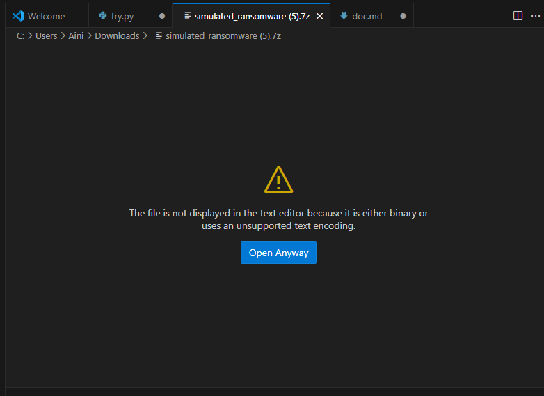
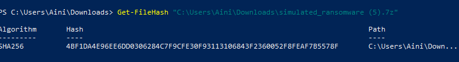
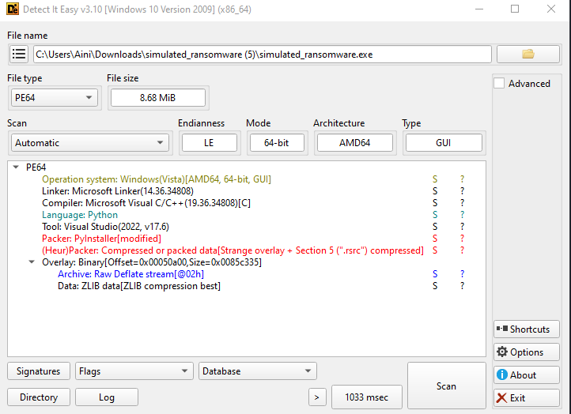
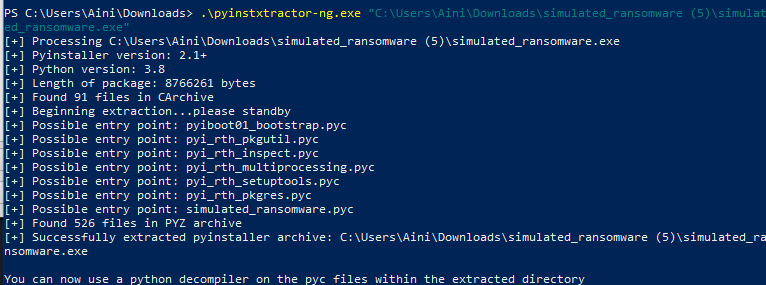
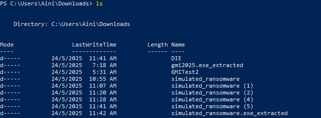
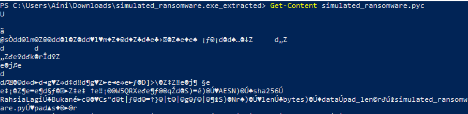
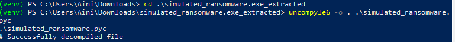
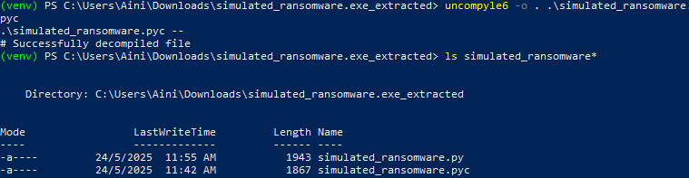
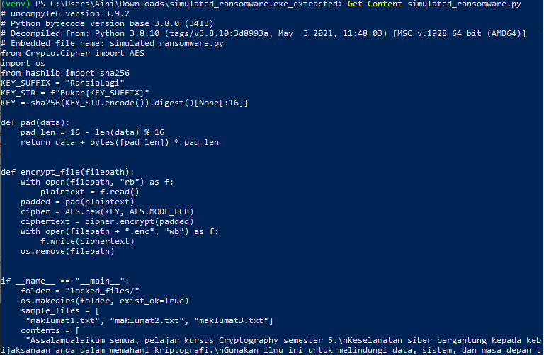

# Practical Test 2

## 1)  Tools that we need :


- ### Windows 10

- ### Windows Powershell

-  ### VSCODE (Visual Studio Code)
```bash
https://code.visualstudio.com/download
```

 - ### Python 3.8
 (since this version only that is supported for decompilation)

```bash
https://www.python.org/ftp/python/3.8.10/python-3.8.10-amd64.exe
```

- ### DIE *(Detect It Easy)* 
 As a static analysis tool to identify what a file is made of especially executable files like .exe, packed files, or compiled scripts

```bash
https://github.com/horsicq/DIE-engine/releases
```

- ### PyInstaller Extractor (Pyinstxtractor)
```bash
https://github.com/pyinstxtractor/pyinstxtractor-ng https://github.com/pyinstxtractor/pyinstxtractor-ng/releases/download/2025.01.05/pyinstxtractor-ng.exe
```


- ### Pyc decompiler (uncompyle6)

```bash
pip install uncompyle6
```

## 2) Steps

### The file of simulated_ransomware.7z is not readable because it's in binary




### 2.1. Identify the binary

- Hash 
```bash
Get-FileHash "C:\Users\Aini\Downloads\simulated_ransomware (5).7z"
```


- Identify the programming language,using DIE



## 2.2 Convert .exe to .pyc

In powershell
```bash
.\pyinstxtractor-ng.exe <filename>
.\pyinstxtractor-ng.exe "C:\Users\Aini\Downloads\simulated_ransomware (5)\simulated_ransomware.exe"
```


For this,I just drag and drop


## 2.3 Move into pycgmi2025.exe_extracted

Use 
```bash
ls
```

To see if the file has extracted



Then,get into the file 

```bash
 cd .\simulated_ransomware.exe_extracted\
 ```


### 2.3.1 List all the files under pycgmi2025.exe_extracted to see the gmi2025.pyc existed

```bash
 ls simulated_ransomware*
```

### 2.3.2 See the simulated_ransomware.pyc is unreadable

```bash 
 Get-Content simulated_ransomware.pyc
 ```




### 2.4 Make it readable by converting .pyc to .py

Make sure you're in virtual environment first 

```bash
.\venv38\Scripts\activate
```

Then,convert .pyc to .py using Pyc decompiler 

``` bash
uncompyle6 -o . .\simulated_ransomware.pyc
```



Then,use ls again to see whether the simulated_ransomware.py existed or not 




### 2.5 See the Get-Content simulated_ransomware.py (readable)

```bash
Get-Content simulated_ransomware.py
```




